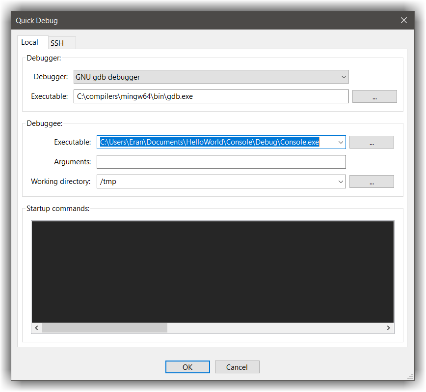
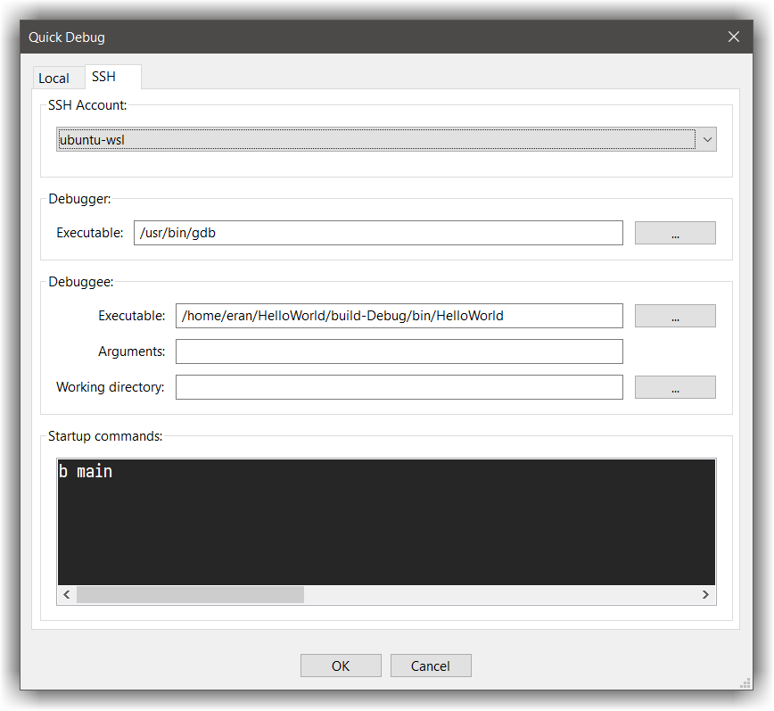

# Quick Debug

## Debugging locally
---

Sometimes you'll want to use CodeLite just as a front-end to gdb: in other words, to launch and debug a binary that doesn't have a CodeLite workspace. 
You can do this with `Debug` &#8594; `Quick Debug`. This brings up the Quick Debug dialog, which has boxes for the filepath of the binary to be debugged (essential) 
and the Working Directory to which to change (less essential); and one for any arguments to pass to the program (not essential). 
You can also select which debugger to use (the likely choices being gdb or none :p) and `Startup Commands`, where you can add commands to be passed direct to gdb.

An example is worth a thousand pictures.

Follow the steps described in the [Quick Start section](../hello_world.md#hello-world-program) and build the `Hello World` example
this should create you `Demo.exe` file (assuming you are Windows)

Next,

- Open the Quick Debug dialog from `Debugger` &#8594; `Quick Debug` 
- Select the `Local` tab
- Under `Debuggee` &#8594; `Executable` section, choose the `Demo.exe` file
- Click `OK` 

The debugger will start, and then pause automatically at first execution line of the `main` function.
From here, you can interact with the debugger [as described here](gdb.md#interacting-with-the-debugger)

## Remote debugging over SSH
---

!!! TIP
    SSH accounts can be defined from `Plugins` &#8594; `SFTP` &#8594; `Open SSH account manager`

!!! WARNING
    SSH accounts **MUST** be using ssh keys and **not** passwords in order to work properly

With recent versions of CodeLite it is possible to debug on a remote machine or (WSL) using the Quick Debug dialog.
To enable this:

- Select the `ssh` tab
- Under `SSH Account`, select the `SSH` account you defined in CodeLite
- Under the `Debugger` &#8594; `Executable` set the path to `gdb` on the **remote machine** (usually, `/usr/bin/gdb`)
- Under the `Debuggee` &#8594; `Executable` choose the executable to debug on the remote machine

from here on, the process is similar to debugging local executable

