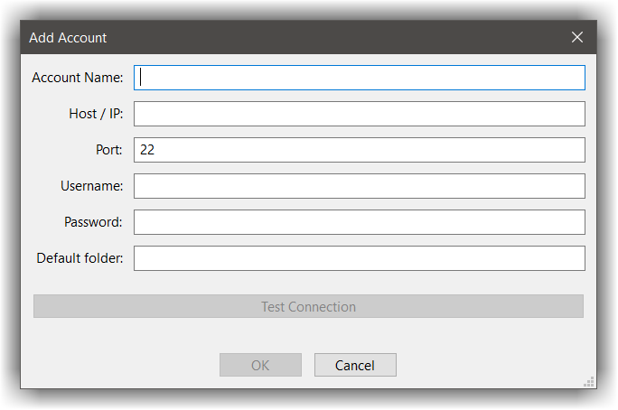

# SFTP
---

This plugins uses the extends CodeLite functionality to provide remote access to remote machines.
When this plugin is enabled, you get a new tab in the workspace view named `SFTP` which provides an Explorer
like view to a remote file system on a remote machine.

To browse the remote machine file system you first need to define an SSH account.

## Installing SSH Tools on Windows
---

On Windows 10 and later, install OpenSSH tools as described [here](https://docs.microsoft.com/en-us/windows-server/administration/openssh/openssh_install_firstuse) 

## Uploading keys to remote machines
---

To generate a public key which allows you to access a remote machine without typing a password, run this from a terminal 
and follow the instructions (usually clicking `ENTER` do the trick):

```bash
ssh-keygen -t rsa -C "YOUR@EMAIL.COM"
```

The above will generate 2 files for you:

```bash
~/.ssh/id_rsa
~/.ssh/id_rsa.pub
```
!!! TIP
    Under Windows, these files are placed under `%USERPROFILE%\.ssh`
    
Copy the content of the file `id_rsa.pub` and append it to the file `~/.ssh/authorized_keys` on the **remote** machine

A one liner to do this

- Open a terminal and ssh into the remote machine
- Type this from the terminal (replacing `id_rsa.pub content goes here` with the actual content):

```bash
echo "id_rsa.pub content goes here" >> ~/.ssh/authorized_keys
```

## SSH accounts
---

Now that you have created a key to access to the remote machine, its time to define an account in CodeLite.

From the main menu bar, open the account manager dialog:


- `Plugins` -> `SFTP` -> `Open SSH account manager`
- Click on the `Add` button
- Fill the following fields:



Field name | Description | Mandatory 
-----------|-------------|------------
Account Name| Give the account a meaningful name |&check;
Host / IP | Remote machine IP or DNS |  &check;
Port | SSH server port, most ssh servers are accepting connections on port `22`|
Username | Login user name on the remote machine |  &check;
Password | When login using password based access, this will be the password | 
Default folder | Set a default folder for the account |

- Finally, click the `Test connection` button to test your account

## The SFTP Explorer view
---

In addition for defining new SSH accounts in CodeLite, the SFTP plugin offers a tree view to a remote machine

- In the workspace pane, select the `SFTP` tab (if its not there, you can check under the `Hidden tabs` menu)
- Click on the `Connect` tool button 


- In the dialog that shown:
    - Check the option `connect to an existing account`
    - Select the account from the drop down list
    
You should now be able to browse files on the remote machine
