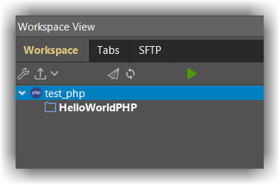
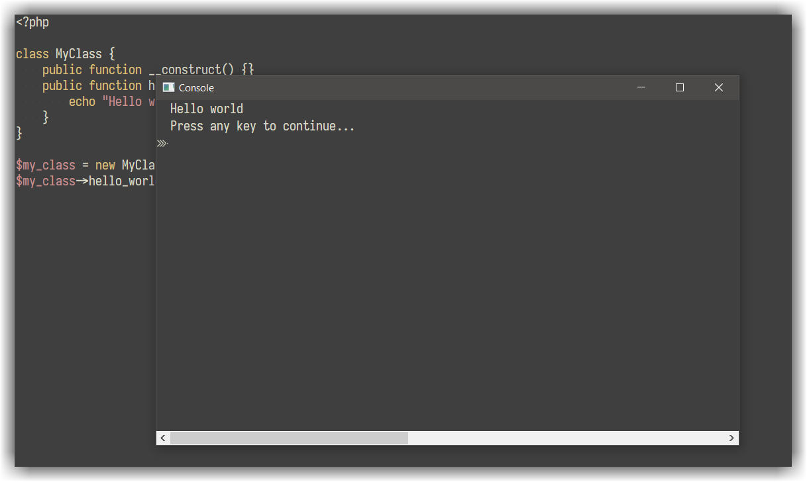

# General
---

As of CodeLite 7.0, PHP support in CodeLite has been extended to provide a fully workable PHP environment for editing and building a PHP application or a simple website.

The PHP plugin supports (but is not limited to) the following:

- Code Completion
- Debugging capabilities via [XDebug](https://xdebug.org/)
- Syntax checking
- Simplified project management
- Class wizard
- Remote synchronizing over SFTP
- Re-factoring 

## Concepts
---

### The Workspace file
---
CodeLite's PHP workspace file contains the following information:

- List of project files
- Metadata (workspace file format version and other info needed by CodeLite) 

Only one PHP workspace can be loaded at a time within CodeLite; however, each workspace may contain multiple projects.
Each workspace is represented on the file system as a single file with the extension `.workspace`

### The Project files
--

Each PHP project corresponds to a real directory on the file system (i.e. there are no Virtual Directories as there are with standard C++ CodeLite projects).

A project may contain sub folders, each corresponding to a dir in the matching position on the file system. However you don't have to include every real dir; 
you may define filters to define which dirs and files you wish to view (e.g. `.git`, `.svn` etc) in the project settings.

!!! Important
    Projects can't be nested: a project tree can't contain another project.
    
## Getting Started by an example
---

### Create your first workspace
---
- Create an empty workspace: `File` &#8594; `New` &#8594; `New workspace` and select `PHP`
- Choose the workspace `Path`, for the `Name` set it to `test_php` and click `OK`

### Add your first project

* Right click on the PHP workspace icon in the tree view and select `Create a new project` to start the new project wizard the wizard will guide you through the new project process by gathering the following information:

| Project property  | Description |
|-------------------|-------------|
| `Project name`      | The name of the project |
| `Project location`  | the project location. This is where CodeLite will create the `.project` file|
| `Project type`      | Is this a web project or command line? |
| `PHP executable`    | Path to `php` executable (`php.exe` on Windows)|
| `Code completion folders` | Extra locations where CodeLite parser can find PHP files for code completion purposes|

For the purpose of our example, set the `Project name` to `HelloWorldPHP`

* Your tree view should look similar to this:



* Create a new file: `hello_world.php` by right clicking on the `HelloWorldPHP` folder in the tree view and choose `New file...`
* In the dialog that pops, set the file name to `hello_world.php`
* Paste the below code onto the newly created `hello_world.php` file:

```php
<?php

class MyClass {
    public function __construct() {}
    public function hello_world() {
        echo "Hello world";
    }
}

$my_class = new MyClass();
$my_class->hello_world();
```

* Run your code by clicking ++ctrl+f5++
* The `Run project` will show, keep the default values and click `OK`
* You should see a CodeLite terminal with the `Hello World` message shown



## Syntax checking
---

CodeLite has built-in integration for [PHP_CodeSniffer](https://github.com/squizlabs/PHP_CodeSniffer), [PHPMD](https://github.com/phpmd/phpmd) and basic php lint.

These tools look for code style violations, code design issue and basic syntax errors. 
When an issue is detected a marker will be placed to the left of the affected line, hover the marker to view a description of the issue

From the main menu, select `Plugins` &#8594; `PHP Linter` &#8594; `Options`. 
Under the general tab you can enable automatic linting on file load and file save.

Under the Code Sniffer tab you need to specify the path to the `phpcs` `phar` file. 
Configuration of `phpcs` should be done by creating a `phpcs.xml` rule file and placing it under the workspace root folder.

The Mess Detector allows you to point to the `phpmd` `phar` file and an optional rule set `xml` file.
You can use an [online standard generator](http://edorian.github.io/php-coding-standard-generator/) to generate the XML rule files

## Code refactoring
---

CodeLite relies on an external tool for providing PHP refactoring (rename variables, class properties etc) To enable refactoring, follow these steps:

- Download the latest refactoring PHAR file [from here](https://github.com/AJenbo/php-refactoring-browser/releases)
- From the main menu open `Plugins` &#8594; `PHP Refactoring` &#8594; `Options...`, select the `phprefactor.phar` file and click `OK`
- Make sure a valid PHP executable is selected from `PHP` &#8594; `Settings` &#8594; `General` &#8594; `PHP Executable`

You now should be able to perform code refactoring (like renaming variables, moving selected code in to a separate method) 
from the right click menu or from the project level context menu
